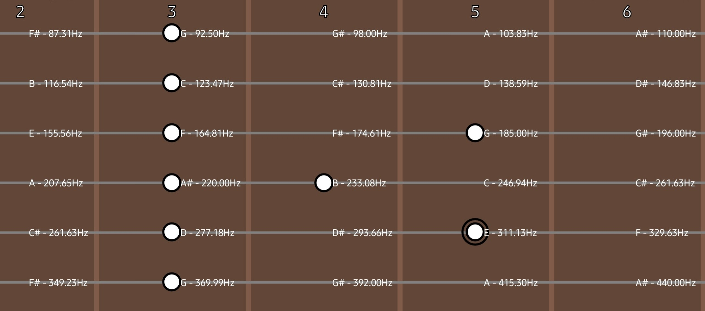

# guitar-viewer
React Native app that creates a visual representation of the guitar scale.

note: personal project - not meant to be the cleanest app ever

# images

[jazzy chord progression that I used to practice some walking bass](github/progression.md)

# running
1. install expo https://docs.expo.dev/get-started/installation/
2. run using `expo run android`

tested on android

# todo
1. chord collection support (wip)
2. in-app sound
3. in-app gigantic database with all chord possibilities o_o